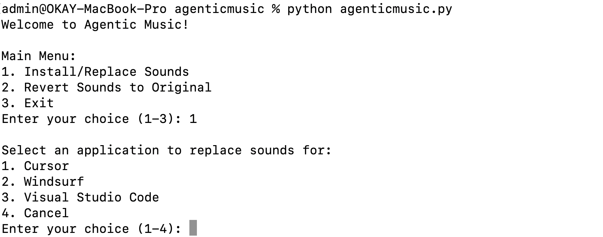

# Agentic Music

This script allows you to replace the default sounds in applications like Cursor, Windsurf, and Visual Studio Code with your own custom sounds. It works by creating symbolic links from the application's sound directories to your custom sound files.

   

## Features

-   Replace sounds for multiple supported applications.
-   Backup original sound files before replacing.
-   Revert to original sounds easily.
-   Simple command-line interface.

## Setup

1.  **Place Custom Sounds:**
    *   Create a directory named `sounds` in the same directory as the `agenticmusic.py` script.
    *   Place your custom sound files (e.g., `.wav`, `.mp3`) into this `sounds` directory.
    *   **Important:** The names of your custom sound files **must exactly match** the names of the sound files used by the target application. For example, if an application uses `clear.wav`, your custom sound must also be named `clear.wav`.

2.  **Permissions:**
    *   This script modifies application files. You may need to run it with administrator privileges (e.g., using `sudo`) if you encounter permission errors.
    *   `sudo python3 agenticmusic.py`

## How to Use

1.  **Run the script:**
    Open your terminal, navigate to the directory where `agenticmusic.py` is located, and run:
    ```bash
    python3 agenticmusic.py
    ```
    If you need administrator rights:
    ```bash
    sudo python3 agenticmusic.py
    ```

2.  **Main Menu:**
    The script will present you with a menu:

    ```
    Vibe Sound Replacer
    ---------------------
    1. Install/Update Custom Sounds
    2. Revert to Original Sounds
    3. Exit
    Enter your choice (1-3):
    ```

3.  **Install/Update Custom Sounds:**
    *   Choose option `1`.
    *   You will then be asked to select the application (Cursor, Windsurf, VS Code) for which you want to replace sounds.
    *   The script will find matching sound files in your `sounds` directory and the selected application's sound directory.
    *   Original sounds will be backed up (e.g., `sound.wav` becomes `sound.wav.bak`).
    *   Symbolic links will be created to point to your custom sounds.
    *   Restart the target application for changes to take effect.


4.  **Revert to Original Sounds:**
    *   Choose option `2`.
    *   Select the application (or all applications) to revert.
    *   The script will remove the symbolic links and restore the original sound files from the backups.
    *   Restart the target application to hear the original sounds again.

## Supported Applications

The script currently supports:
*   Cursor
*   Windsurf
*   Visual Studio Code

The paths for these applications are hardcoded in the script. If your application is installed in a non-standard location, you might need to update the `APP_SOUND_PATHS` dictionary in `agenticmusic.py`.

## Troubleshooting

*   **Permission Errors:** Run the script with `sudo`.
*   **"Sounds directory not found"**: Make sure you have created a `sounds` directory in the same location as the script and placed your custom audio files there.
*   **"No sound files found in the local 'sounds' directory"**: Ensure your custom sound files are directly inside the `sounds` directory, not in subfolders.
*   **Sounds not changing after running:**
    *   Ensure you restarted the target application.
    *   Double-check that your custom sound file names exactly match the application's original sound file names.
    *   Verify the symlinks were created correctly in the application's media folder. 